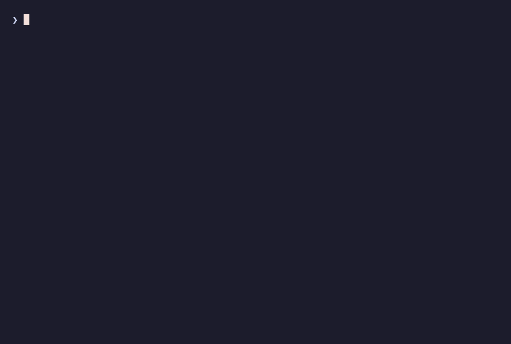

# Prism

> **Claude picks the generic answer by default. Prism makes it choose a lens first.**

Prism is a skill for Claude Code. By default the model goes straight to a result. Type `/prism <task>` and it pauses first: it picks **lenses** — reusable ways of looking at a problem — and lays out the challenges and decisions to settle **before** building anything. It ships with ~142 lenses.



## Usage

- `do X for me` — direct, as usual.
- `/prism do X for me` — it picks the lenses that fit and lays out the decisions first.

To compare, run the same request both ways.

## Install

Prism is a plain folder-skill — no marketplace, no plugins.

**Let Claude do it** — paste to Claude Code:

> Install the skill from https://github.com/xtompie/prism into `~/.claude/skills/prism`

**Or yourself:**

```bash
git clone https://github.com/xtompie/prism.git ~/.claude/skills/prism
```

Restart the session and `/prism` is available. Update with `git pull` in that folder. It has `disable-model-invocation: true`, so it never runs on its own — only when you type `/prism`.

## What's a lens?

A reusable *way of looking* at a problem — not a solution, not domain knowledge, not a procedure. It doesn't give the answer; it changes the angle and raises a question you'd otherwise skip.

**`inversion`** — instead of *"how do I make this succeed?"* it asks *"how would I guarantee this fails?"* Planning a team offsite, "how do I make it great?" gives vague answers; "how would I guarantee a disaster?" gives concrete ones — no budget, too few rooms, booked last-minute, no rain plan — and you turn each into a requirement. That's one lens; Prism has ~142 and picks the ones that fit. Personas ("act as a security reviewer") are lenses too.

## What's in the repo

- `SKILL.md` — the process: pick lenses, lay out decisions, grow the base. No domain knowledge.
- `INDEX.md` — the lens menu: name + when to use.
- `lenses/*.md` — each lens in five lines: `name` / `when` / `when_not` + the move.

The model reads the INDEX and loads only the few lenses that fit a task, not the whole set. Lenses come from three places: the model's own knowledge, this folder, and — only when you ask — the web, to find a new way of looking and save it back here. The base grows from use, with a check against duplicates.

## When to use it

On complex, ambiguous, hard-to-reverse work, where a wrong first move is expensive. For typos, renames, and anything cheap to undo, skip it — an entry gate drops out of Prism mode on easy tasks on its own.
